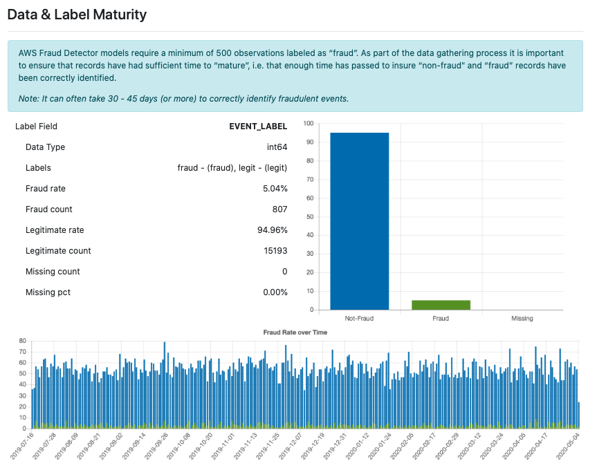

# AWS Fraud Detection, FD (사기 감지) 소개

## FD 워크 플로우 요약
- EVENT 정의
- MODEL VERION 훈련 (모델 학습)
- DETECTOR 생성 (엔드 포인트 생성)
    - 모델 버전과 decision rules를 사용하여 생성 
- 추론 
    - 추촌 함수 통해 예측치 얻음
    
## 노트북
- getstart/1.1.Holdout-Fraud_Detector_End_to_End.ipynb
    - 훈련/검증 데이터를 나누어서 훈련 및 검증 함.

## 데이터 준비

####  데이터 수집
- 10k 이상의 데이터
- 최근 3-6개월 동안 최소 6주 이상의 과거 데이터
- 최근 데이타로 검증 데이터 셋을 생성한다.

#### 데이터 & 레이블 Maturity
- non-fraud, fraud 가 충분히 데이터가 생성되어야 한다. (약 30-45 일 걸릴 수 있음)
- 적어도 최근 30일 이상의 데이터가 필요함ㄹ

#### Sampling
- 내부에서 진행. 작업할 필요 없음

#### Fraud Labels
- 최소 500개 이상의 Fraud 관측값이 필요함.

#### Custom Fields
- event timestamp, ip address, email address, fraud label 이 의무적으로 준비를 해야 함.. 가타 커스텀 필드도 넣으면 좋음

## 데이터 프로파일링

## 레퍼런스
- An Introduction to the Amazon Fraud Detector API
    - https://github.com/aws-samples/aws-fraud-detector-samples/blob/master/Fraud_Detector_End_to_End.ipynb
- Roc Curve
    - https://towardsdatascience.com/understanding-auc-roc-curve-68b2303cc9c5

